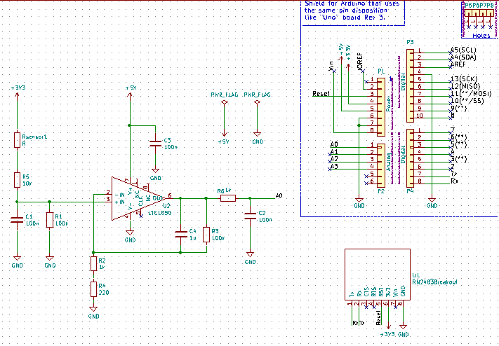

# MICRO-CONTROLEURS ET OPEN-SOURCE HARDWARE - Capteur de gaz et communication LoRa - Shield Arduino
Ce projet a été réalisé dans le cadre de l'enseignement "Microcontrolleurs et Open-Source Hardware" de la 5e année "Innovative Smart Systems" à l'INSA de Toulouse. 

Le projet à été realisé par AYOUBA Gael et HO Fabian, Etudiants en Informatique et Réseaux au sein du département du GEI.

# Objectif
L'objectif de ce projet est de concevoir un circuit imprimé complet (PCB). 
Le circuit est ensuite utilisé avec une carte Arduino et  une puce LoRa. 
Les données récoltées seront envoyées via le protocole LoRa sur la plateforme TTN (The Things Network).

# Equipement
- Shield Capteur de gaz

- Arduino uno 	

- Module LoRa RN2483 breakout

# Fonctionnalités
- Capteur de gas avec le branchement (Nécessitant la réalisation en salle blanche)
- Circuit d’adaptation du capteur de gaz vers l’ADC de l’Arduino UNO :
  - Filtrage des bruits contenant 2 filtres passifs et un filtre actif avec l'AOP LTC1050
  - Filtrage anti-repliement pour realiser l'echantillonage de l'ADC
- Adaptation du calibre
 
# Contenus
Ce projet contient le code source et les fichiers de conception:

- La partie schématique, décrivant le circuit électronique implémenté (composants, routage des pins)
- La partie layout, décrivant la forme de la carte, l’emplacement des différents éléments sur celle-ci et la trajectoire des pistes de routage ainsi qu'une partie 3D.
- Code arduino pour LoRa

# Schemas PCB
Conception du schematic :

Voici plusieurs fonctionnalités du schema:

- La résistance d'entrée (R1) est une resistance de protection, elle protège l'amplificateur opérationnel des décharges électrostatiques. De plus celle ci est associée au condensateur C1 pour filtrer le bruit de tension.
- Le circuit entre le condensateur C1 et la résistance R2 nous permet de filtrer le bruit de courant.
- La résistance R3 est utilisée pour adapter notre montage au calibre correct. La resistance R3 peut être modifiée afin de mieux calibrer le montage.
- Nous avons mis en place un filtre actif grace au circuit entre le condensateur C2 et la resistance R4 en sortie de l'amplificateur.
- la résistance R5 et le condensateur C4 constituent un filtre passe-bas en sortie de l'ensemble.
- Enfin, le condensateur C3 filtre le bruit provenant de l’entrée de tension 5V.

# PCB footprint sur KiCad
Conception du Layout:

Afin de realiser le footprint correctement, nous avons mis en pratique les points suivants:
- Nous avons choisi une largeur de piste de 0.8 mm, afin que notre constructeur puisse le réaliser avec son équipement.
- Nous avons decidé d'inserer uniquement la connectique de la plaque RN2483 Breakout afin d'optimiser l'espace du footprint. D'autant plus que nous considerons que la carte RN2483 ne sera pas directement integrée sur le shield mais reliée par des fils (connecteur).
- Nous avons utilisé une couche de GND au verso de la plaque nous permettant d'optimiser encore plus notre espace en réduisant le nombre de connections.

Comme le montre l'image ci-dessus, il s'agit d'un tracé sur une seule face. 
# PCB 3D view
Vision 3D:
Vous pouvez voir ci-dessous une représentation 3D de notre conception. 
Le choix des composant a été réalisé sous la condition qu'ils soient traversants et le plus petit possible.

